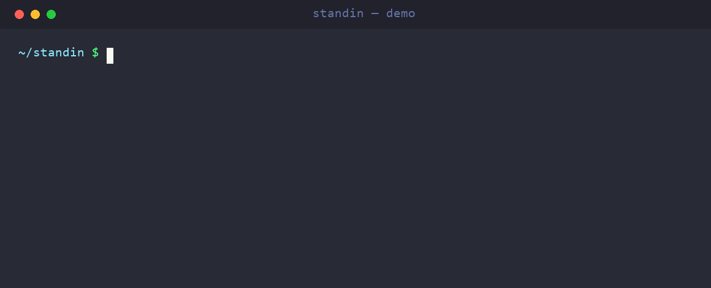

# standin

**A stand-in for the real LLM in your tests.** Record your LLM API calls once, then replay them forever: fast, free, deterministic, and fully offline. One line, any provider.

<p align="center"></p>

```python
import standin

with standin.use_cassette("tests/cassettes/summary.json"):
    reply = client.chat.completions.create(model="gpt-4o", messages=[...])
# First run: hits the real API and records it.
# Every run after: replayed from disk. No network, no cost, same answer.
```

Your LLM tests are slow, flaky, and cost money because they hit real APIs. `standin` makes them **deterministic and offline** by recording the real HTTP calls once and replaying them after, with the things LLM devs actually need: **streaming**, **tool-calls**, **secret redaction**, and **body-aware matching**.

---

## Why not just VCR.py?

VCR.py is great, but it's a general HTTP tool. `standin` is built for LLMs:

- **Provider-agnostic, zero wiring.** It hooks `httpx`, `requests`, and `aiohttp`, so it works with **OpenAI, Anthropic, Gemini, Mistral, Cohere, litellm, LangChain, LlamaIndex** and anything else built on those three clients. No per-SDK adapters.
- **Streaming just works.** Server-sent event (SSE) responses are recorded and replayed intact.
- **Safe to commit.** Auth headers, secret-shaped tokens (OpenAI, Anthropic, AWS, Google, GitHub, Slack, JWTs), secret field names in bodies, and credentials in the URL (basic-auth userinfo, `?api_key=`/`?key=` query params, form-encoded `client_secret`) are **redacted automatically**, so cassettes can live in a public repo. `standin verify` re-checks a cassette in CI and fails if anything still looks live.
- **Body-aware matching.** Requests match on normalized JSON, so key ordering and formatting noise don't break replays. Repeated identical calls (agent loops) replay in order.
- **Replay misses explain themselves.** When no recording matches in replay-only mode, the error names the closest recording and shows a field-level diff (or tells you the recording was already replayed), instead of a bare "not found".
- **One-line pytest fixture**, with sane auto-named cassettes.
- **Clean, typed, extensible core** (see [ARCHITECTURE.md](ARCHITECTURE.md)): swap the matcher, redactor, or storage backend.

## Install

```bash
pip install standin
```

Python 3.9+ and `httpx` (already a dependency of the major LLM SDKs).

## Quickstart

### With pytest (recommended)

```python
import pytest

@pytest.mark.standin          # cassette auto-named tests/cassettes/test_summarize.json
def test_summarize(standin):
    out = summarize("war and peace")     # your code that calls an LLM
    assert "Napoleon" in out
```

First run records against the real API; every run after replays from the cassette. Commit the cassette and teammates (and CI) run the test with **no keys and no network**.

### Anywhere (context manager)

```python
import standin
from openai import OpenAI

client = OpenAI()
with standin.use_cassette("tests/cassettes/haiku.json"):
    resp = client.chat.completions.create(
        model="gpt-4o-mini",
        messages=[{"role": "user", "content": "haiku about testing"}],
    )
```

## Modes

| Mode | Behavior |
| --- | --- |
| `once` (default) | Replay if the cassette exists, otherwise record it. |
| `none` | Replay only. **Errors on any unrecorded call**; use this in CI. |
| `all` | Always re-record, ignoring existing interactions. |
| `new_episodes` | Replay what's recorded, record anything new (great for agent loops). |

**In CI**, force replay-only for the whole run so a stray live call fails loudly:

```bash
STANDIN_MODE=none pytest
```

Under pytest you can also set the mode from the command line, which is handy for a
one-off re-record without editing markers or exporting an env var:

```bash
pytest --standin-mode=none    # replay-only for this run
pytest --standin-record       # shorthand for --standin-mode=all (re-record everything)
```

An explicit `--standin-mode`/`--standin-record` wins over both the `@pytest.mark.standin`
mode and `STANDIN_MODE`; with neither flag, the existing marker and `STANDIN_MODE`
behavior is unchanged.

## Performance

With the default matcher, replay is **O(1) per request**: the cassette indexes
recorded interactions by request key and pops the next match, instead of scanning
the whole cassette. Replaying a 5,000-interaction cassette runs about **5.5x** faster
than the linear scan (`benchmarks/bench_matching.py`), and the per-request cost stays
flat as the cassette grows. Fuzzy and semantic matchers keep the linear scan.

## What a cassette looks like

Plain, reviewable JSON, secrets already stripped:

```json
{
  "version": 1,
  "recorded_with": "standin",
  "interactions": [
    {
      "request": {
        "method": "POST",
        "url": "https://api.openai.com/v1/chat/completions",
        "headers": { "authorization": "[REDACTED]" },
        "body": { "json": { "model": "gpt-4o-mini", "messages": [ ] } }
      },
      "response": { "status_code": 200, "body": { "json": { "choices": [ ] } } }
    }
  ]
}
```

## Extending it

Everything is a small protocol you can replace (see [ARCHITECTURE.md](ARCHITECTURE.md)):

```python
standin.use_cassette(path, matcher=MyMatcher(), redactor=MyRedactor(), store=MyStore())
```

- **Matcher**: decide when a live request equals a recorded one. Three ship:
  `DefaultMatcher` (exact, JSON key-order-insensitive), `FuzzyMatcher` (body may
  drift up to a string-similarity threshold, so a reworded prompt still replays),
  and `SemanticMatcher` (body matches on embedding cosine similarity, so a
  paraphrase still replays). `SemanticMatcher` stays dependency-free: you pass an
  `embed` callable, so it works with sentence-transformers, an embeddings API, or
  anything else.

  ```python
  from standin import use_cassette, FuzzyMatcher, SemanticMatcher, DefaultRedactor
  with use_cassette(path, matcher=FuzzyMatcher(DefaultRedactor(), threshold=0.9)):
      ...
  # embed: Callable[[str], Sequence[float]]; wire your own model or service.
  with use_cassette(path, matcher=SemanticMatcher(embed, DefaultRedactor(), threshold=0.95)):
      ...
  ```
- **Redactor**: control what gets scrubbed before writing.
- **CassetteStore**: change the on-disk format.

## Command line

```bash
standin list   tests/cassettes/summary.json          # one line per interaction
standin show   tests/cassettes/summary.json 0        # full request/response
standin stats  tests/cassettes/summary.json          # counts by method/status
standin scrub  tests/cassettes/summary.json          # re-run secret redaction in place
standin verify tests/cassettes/summary.json          # exit non-zero if a secret remains
standin diff   old.json tests/cassettes/summary.json # what changed between two cassettes
```

`verify` is a **"safe to commit?" gate**: it prints a summary, then scans every
URL, header, and body for anything still shaped like a live secret (OpenAI/Anthropic/AWS/
Google keys, JWTs, auth headers, secret field names, credentials in the URL). A clean
cassette exits `0`; any finding is printed with its location and exits non-zero, so it
drops into CI or a pre-commit hook:

```bash
standin verify tests/cassettes/*.json
```

The scanner and the redactor share one set of rules, so anything `scrub` masks is
exactly what `verify` looks for.

`diff` compares two cassettes interaction by interaction, handy for reviewing what
a re-record changed. It matches requests the same way replay does, then reports which
interactions are only in the first, only in the second, and which match by request but
whose response changed (status and/or body). It exits `0` when the two are identical,
`1` when they differ, and `2` on a load error:

```bash
standin diff old.json tests/cassettes/summary.json
```

## Contributing

See [CONTRIBUTING.md](CONTRIBUTING.md). Run the suite with `pytest`, lint with `ruff`, type-check with `mypy`.

## License

MIT. See [LICENSE](LICENSE).
